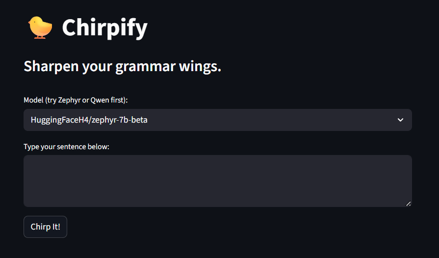

# 🐤 Chirpify

Chirpify is a friendly **AI-powered grammar coach** built with Streamlit and Hugging Face models.  
It corrects your sentences, explains the grammar, and motivates you — all in just **three lines**.

---

## 🚀 Live Demo
[Click here to try Chirpify on Streamlit](https://chirpify.streamlit.app/)

---

## ✨ Features
- Grammar correction using top Hugging Face chat models.
- Short & friendly grammar explanations.
- Motivational “bird vibes” 🐤.
- Fun animated bird while generating responses.
- Choice of multiple models like Zephyr, Qwen, Mistral, and more.

---

## 🛠️ Tech Stack
- **Python**
- **Streamlit**
- **Hugging Face Hub**
- **dotenv** for environment variables

---

## 📦 Installation & Run Locally
1. Clone the repo:
   ```bash
   git clone https://github.com/<your-username>/<your-repo>.git
   cd <your-repo>
2. Install dependencies:
    ```bash
   pip install -r requirements.txt
3. Create a .env file:
    ```bash
   HF_TOKEN=hf_your_huggingface_token
4. Run the app:
    ```bash
   streamlit run app.py

---

## 📸 Preview


---

## 📜 License
MIT License

